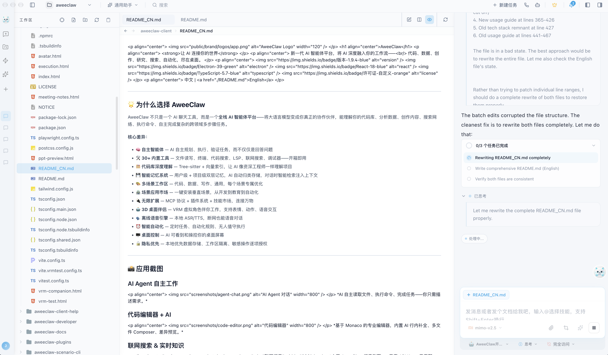
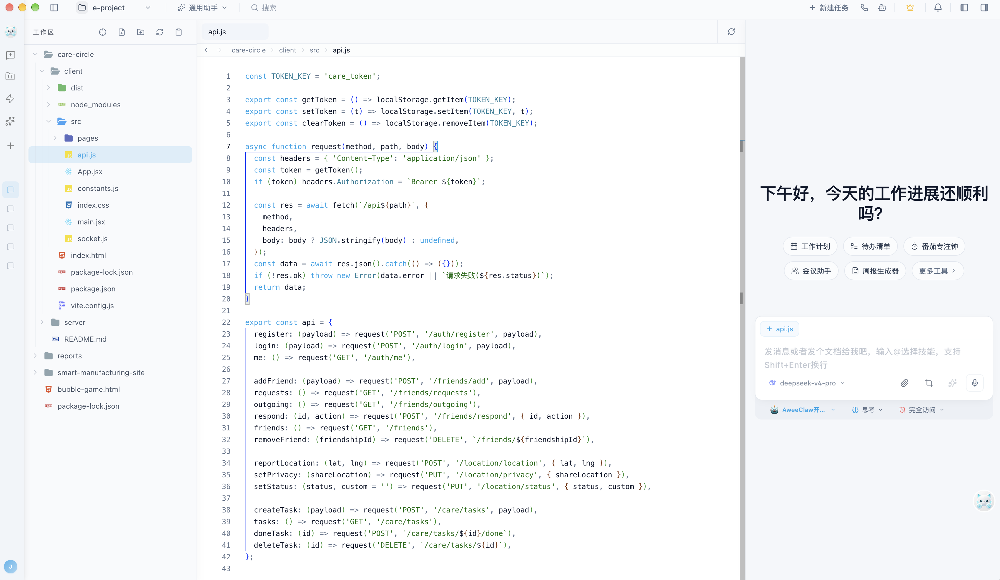
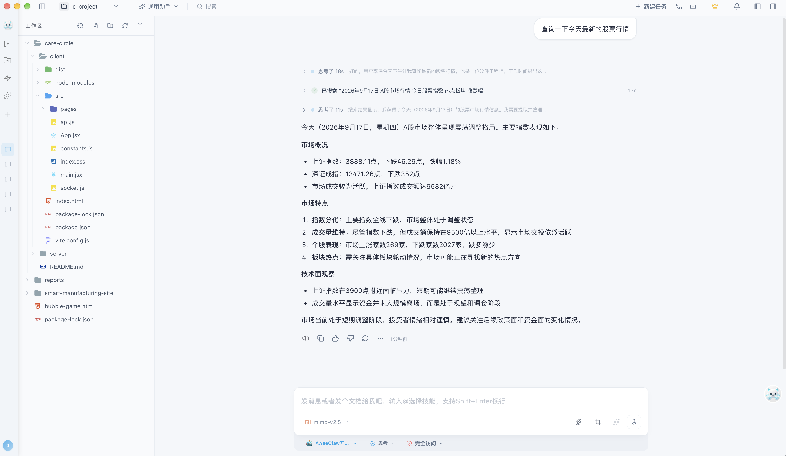
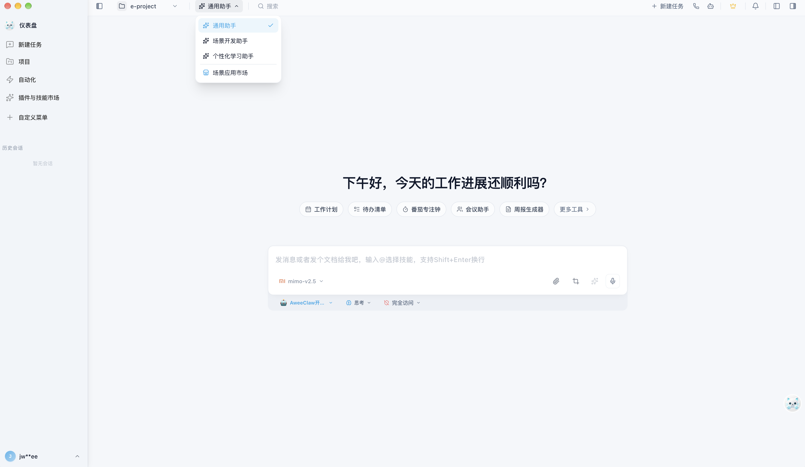
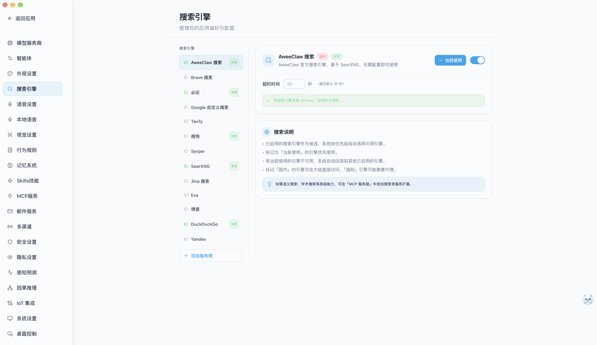
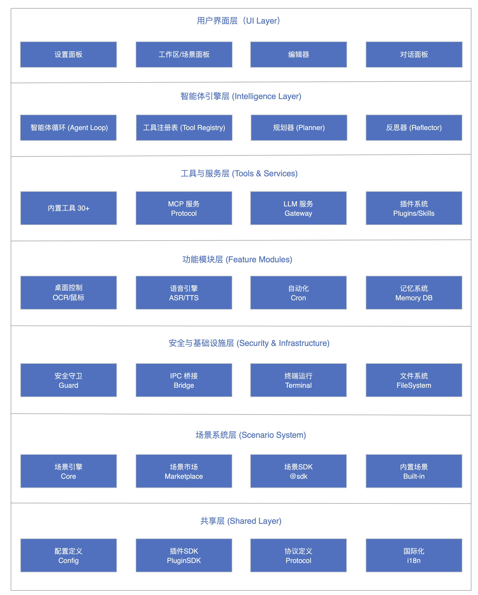

<p align="center">
  
</p>

<h1 align="center">AweeClaw</h1>

<p align="center">
  <strong>让 AI 连接你的世界</strong>
</p>

<p align="center">
  新一代 AI 智能体平台，将 AI 深度融入你的工作流——<br/>
  代码、数据、创作、研究、搜索、自动化，尽在桌面。
</p>

<p align="center">
  
  
  
  
  
</p>

<p align="center">
  中文 | <a href="./README.md">English</a> | <a href="https://www.aweeclaw.com/" target="_blank">官网</a> | <a href="https://docs.aweeclaw.com/" target="_blank">文档</a>
</p>

---

## 🌟 为什么选择 AweeClaw

AweeClaw 不只是一个 AI 聊天工具，而是一个**全栈 AI 智能体平台**——将大语言模型变成你真正的协作伙伴，能理解你的代码库、分析数据、创作内容、搜索网络、执行命令、自主完成复杂的跨领域多步骤任务。

**核心差异：**

- 🧠 **自主智能体** — AI 自主规划、执行、验证任务，而不仅仅是回答问题
- 🛠️ **30+ 内置工具** — 文件读写、终端、代码搜索、LSP、联网搜索、调试器——开箱即用
- 🗂️ **代码库深度理解** — Tree-sitter + 向量索引，让 AI 像资深工程师一样理解项目
- 💾 **智能记忆系统** — 用户级 + 项目级双层记忆，AI 自动归类存储，对话时智能检索注入上下文
- 🎨 **多场景工作区** — 代码、数据、写作、通用，每个场景专属优化
- 🏪 **场景应用市场** — 一键安装垂直场景，从开发到教育到自动化
- 🔌 **无限扩展** — MCP 协议 + 插件系统 + 技能市场，连接万物
- 🤖 **3D 桌面伴侣** — VRM 虚拟角色伴你工作，支持表情、动作、语音交互
- 🗣️ **离线语音引擎** — 本地 ASR/TTS，断网也能语音对话
- ⏰ **智能自动化** — 定时任务、自动化规则、无人值守执行
- 🖥️ **桌面控制** — AI 可看到和操控你的桌面屏幕
- 🔒 **隐私优先** — 本地优先数据存储、工作区隔离、敏感操作逐项授权
---

## 📸 应用截图

### AI Agent 自主工作
<p align="center">
  
</p>
*AI 自主读取文件、执行命令、完成任务——你只需描述需求。*

### 代码编辑器 + AI
<p align="center">
  
</p>
*基于 Monaco 的专业编辑器，内置 AI 行内补全、多文件 Composer、差异预览。*

### 联网搜索 & 实时知识
<p align="center">
  
</p>
*内置 AweeClaw 搜索引擎——无需 API Key、无需配置，国内开箱即用。*

### 多场景工作区
<p align="center">
  
</p>
*代码、数据、写作、通用场景自由切换——每个场景都有专属工具和界面。*

### 设置 & 搜索引擎
<p align="center">
  
</p>
*AweeClaw 搜索为默认引擎——基于自建 SearXNG 集群，聚合 70+ 搜索引擎。*

---

## ✨ 核心能力

### 🤖 1. 自主 AI 智能体

智能体不只是聊天——它会**规划、执行、验证**。

- **3 种工作模式**：Chat（问答）、Agent（自主任务执行）、Plan（分步规划执行）
- **全流程流式输出**：实时展示 AI 思考过程、工具调用、生成内容
- **工具链式调用**：AI 可顺序调用 30+ 工具完成复杂工作流
- **上下文压缩**：自动压缩历史记录，长对话不丢失关键信息
- **会话接力**：跨线程上下文延续，工作不中断
- **情绪感知**：根据用户行为模式自适应交互风格

### 🛠️ 2. 30+ 内置工具

| 分类 | 工具 | 功能 |
|------|------|------|
| **文件读写** | `read_file`, `write_file`, `edit_file`, `list_directory` | 读取、创建、修改文件和目录 |
| **终端** | `execute_command`, `run_terminal_command` | 执行 Shell 命令（带安全检查） |
| **代码搜索** | `search_files`, `codebase_search` | Ripgrep 精确搜索 + 语义搜索 |
| **LSP** | `diagnostics`, `go_to_definition`, `find_references` | 完整语言服务器集成 |
| **联网** | `web_search`, `read_url` | 网络搜索、URL 抓取解析 |
| **规划** | `todo_read`, `todo_write`, `plan_create` | 任务规划与进度跟踪 |
| **UI/UX** | `uiux_search` | 12 个设计领域 × 13 个技术栈数据库 |
| **办公文档** | `read_document` | PDF、Word、Excel、PPT 解析 |
| **记忆** | `remember`, `knowledge_search` | 项目记忆持久化、知识库语义检索 |
| **桌面控制** | `screen_capture`, `mouse_click`, `keyboard_type` | 截屏、鼠标模拟、键盘模拟 |
| **交互** | `ask_user`, `attempt_completion`, `companion_control` | 用户确认、任务完成、桌面伴侣控制 |
### 🗂️ 3. 深度代码库理解

AweeClaw 为你的项目构建**多层索引**，让 AI 像资深工程师一样理解上下文：

- **结构索引** — Tree-sitter 解析 25+ 种语言，零配置
- **语义索引** — 向量嵌入 + LanceDB，深度语义检索
- **符号索引** — 自动提取函数、类、接口等代码符号
- **项目摘要** — AI 自动生成架构概览和关键文件说明

### 🔍 4. AweeClaw 搜索——零配置联网搜索

默认搜索引擎为 **AweeClaw 搜索**，基于自建 SearXNG 集群：

- ✅ **无需 API Key** — 安装后立即可用
- ✅ **国内可访问** — 聚合百度、Bing、搜狗、360 等
- ✅ **70+ 引擎** — 元搜索，自动去重
- ✅ **15 分钟缓存** — Redis 加速重复查询
- ✅ **隐私优先** — 无追踪、无画像

同时支持 12+ 其他引擎：Bing、Google PSE、Tavily、Brave、Serper、Exa、Jina、博查、搜狗、DuckDuckGo、Yandex、自建 SearXNG。

### 🎨 5. 多场景工作区

| 场景 | 优化方向 |
|------|----------|
| **代码编辑器** | 软件开发：Monaco 编辑器、LSP、Git、调试器 |
| **数据分析师** | 数据分析、可视化、仪表盘 |
| **创意写作** | 长文写作、小说、文案创作 |
| **通用助手** | 日常问答、研究、通用任务 |
| **法律助手** | 合同审查、合规分析、法律研究 |
| **医学助手** | 症状参考、医学文献检索、临床指南 |
| **教育辅导** | 个性化辅导、知识问答、学习计划 |

每个场景有专属的工具集、提示词模板和 UI 布局——从侧边栏一键切换。

### 🏪 6. 场景应用市场

从在线市场一键安装**垂直场景**，快速获得针对特定领域的 AI 能力：

- **浏览与搜索** — 按分类（开发、数据、创意、效率、教育、自动化）浏览场景
- **一键安装** — 依赖检查、版本管理、自动更新
- **付费场景** — 支持开发者发布付费场景，内置支付与授权
- **版本管理** — 查看更新日志、回退版本、兼容性检查
- **场景构建器** — 内置可视化场景开发工具，零代码/低代码创建自定义场景
- **场景 SDK** — 开发者可基于 `@aweeclaw/scenario-sdk` 快速构建场景

### 🔌 7. 插件与技能市场

无限扩展 AI 的能力边界：

- **MCP 插件** — 基于 Model Context Protocol，连接任意外部工具与服务
- **技能包（Skills）** — 可复用的提示词模板包，按需加载领域专家知识
- **插件类型** — MCP 工具、自定义工具、消息通道、场景、钩子、复合插件
- **内置引擎** — 12+ 搜索引擎（Bing、Google、Tavily、Brave、SearXNG 等）
- **自定义引擎** — 添加任何 OpenAI 兼容的 LLM 或自定义搜索引擎
- **热插拔** — 安装、启用、禁用、卸载，无需重启

### 🤖 8. 3D 桌面伴侣

一个始终陪伴你的 **VRM 3D 虚拟角色**，放在桌面上：

- **表情系统** — 开心、生气、悲伤、放松、惊讶等面部表情，自动跟随对话情绪
- **动作动画** — 挥手、思考、伸懒腰、比耶等预设动画，AI 可主动触发
- **语音播报** — AI 回复时自动播报，唇形同步 + 字幕显示
- **目光追踪** — 跟随鼠标或注视摄像头，自然交互感
- **角色卡系统** — 导入/导出 SillyTavern 兼容的角色卡，自定义性格与形象
- **悬浮头像** — 轻量版头像，始终悬浮在桌面最上层，随时呼出 AI

### ⏰ 9. 智能自动化

让 AI 在你不在的时候也能自主工作：

- **定时任务** — Cron 表达式驱动，支持一次性与循环执行
- **自动化规则** — 定义触发条件与执行指令，AI 自主完成
- **远程命令** — 移动端下达指令，PC 端自动执行
- **防休眠守护** — 长任务执行期间自动防止系统休眠，笔记本用户福音
- **执行报告** — 每次执行结果自动记录，可追溯

### 🗣️ 10. 离线语音引擎

支持**纯本地离线**运行的语音识别（ASR）与语音合成（TTS），无需 API Key：

- **本地 ASR** — Sherpa-ONNX 引擎，支持多种语言，实时流式识别
- **本地 TTS** — 多种离线合成引擎，支持中文、英文、日文
- **GPT-SoVITS** — 声音克隆引擎，用少量音频样本即可克隆特定音色
- **云端/本地混合** — 自动切换云端与本地引擎，断网时无缝降级
- **语音对话** — 按住说话 → AI 识别 → AI 回复 → 语音播报，完整闭环
- **有声书** — 导入文档自动转为有声读物，批量 TTS 合成

### 🖥️ 11. 桌面控制

AI 可以**看到和操控**你的桌面：

- **屏幕截图** — 全屏/区域截图，支持多显示器
- **OCR 识别** — 截图后自动识别文字内容
- **鼠标模拟** — 点击、移动、拖拽、滚动
- **键盘模拟** — 文本输入、组合键、单键按下
- **窗口管理** — 列出窗口、聚焦、最小化、最大化、关闭
- **进程管理** — 查看进程列表、按 CPU/内存排序、终止进程
- **应用启动** — 按名称启动/关闭应用
- **紧急停止** — 一键终止所有桌面操作，安全兜底

### 🌐 12. 外部 Agent 集成

将业界顶级 AI 编程工具整合到 AweeClaw 中：

- **Claude Code** — Anthropic 的 CLI 编程智能体
- **Codex** — OpenAI 的代码生成 CLI
- **Cursor** — Cursor 编辑器的无头模式
- **A2A 协议** — Agent-to-Agent 智能体级互操作，跨平台协作

### 📱 13. 设备联动

跨设备协同工作：

- **设备联动** — 移动端与桌面端实时同步，WebSocket 长连接
- **远程桌面控制** — 通过 SSH 远程操控另一台机器的桌面
- **系统监控** — CPU、内存、磁盘、网络、电量实时监控
- **OBS 悬浮层** — 直播时实时显示 AI 字幕与弹幕

### 🔐 14. 安全与隐私

- **权限系统** — 每次文件写入、终端命令、网络调用都需要用户审批
- **工作区隔离** — 严格路径限制，防止越权访问
- **沙箱环境** — 场景运行在沙箱中，隔离于主进程
- **本地优先** — 数据存储在本地，敏感信息不上传
- **审计日志** — 所有敏感操作均有日志记录
- **危险命令拦截** — 终端命令经过黑名单筛查
---

## 🚀 快速开始

### 环境要求

| 依赖 | 最低版本 | 说明 |
|------|----------|------|
| **操作系统** | Windows 10+ / macOS 12+ / Ubuntu 20.04+ | 支持 x64 和 arm64 架构 |
| **Node.js** | >= 18.0 | 推荐使用 LTS 版本 |
| **npm** | >= 9.0 | 或使用 yarn / pnpm |
| **Git** | >= 2.30 | 用于版本控制集成 |
| **磁盘空间** | >= 500 MB | 包含应用和依赖 |
| **内存** | >= 4 GB | 推荐 8 GB 以上以获得最佳体验 |

### 安装与运行

```bash
# 1. 克隆仓库
git clone https://github.com/awee-worker/AweeClaw.git
cd AweeClaw

# 2. 安装依赖
npm install

# 3. 启动开发模式
npm run dev

# 4. 构建生产版本
npm run build
```
## 🏗️ 架构

AweeClaw 采用 **Electron 多进程 + 渲染器分层** 架构，核心遵循 **主进程/渲染进程分离 + IPC 桥接** 的安全模型。整体架构分为 7 个核心层级：

<p align="center">
  
</p>

### 项目目录结构

```
aweeclaw-client/
├── src/
│   ├── main/                        # Electron 主进程（Node.js 环境）
│   │   ├── bootstrap/               # 应用生命周期管理、窗口创建、初始化序列
│   │   ├── bridge/                  # IPC 桥接层（主进程 ↔ 渲染进程安全通信）
│   │   ├── guard/                   # 安全守卫
│   │   │   ├── fileGuard.ts         #   文件访问权限校验（路径白名单）
│   │   │   ├── terminalGuard.ts     #   终端命令黑名单拦截
│   │   │   └── sandboxGuard.ts      #   场景沙箱隔离
│   │   ├── language-server/         # LSP 集成（25+ 语言的代码智能）
│   │   ├── modules/                 # 功能模块（主进程侧）
│   │   │   ├── agent/               #   智能体引擎核心逻辑
│   │   │   ├── automation/          #   自动化引擎（Cron 定时任务、远程命令）
│   │   │   ├── audiobook/           #   有声书（批量 TTS 合成）
│   │   │   ├── character-card/      #   角色卡系统（SillyTavern 兼容）
│   │   │   ├── desktop-control/     #   桌面控制（截屏、OCR、鼠标键盘模拟）
│   │   │   ├── device-link/         #   设备联动（WebSocket 跨设备同步）
│   │   │   ├── floating-avatar/     #   悬浮头像（桌面最上层轻量 AI 入口）
│   │   │   ├── local-voice/         #   离线语音引擎（Sherpa-ONNX ASR/TTS）
│   │   │   ├── meeting-notes/       #   会议纪要（实时转写 + AI 摘要）
│   │   │   ├── memory-db/           #   记忆数据库（用户级 + 项目级双层存储）
│   │   │   ├── overlay/             #   OBS 悬浮层（直播字幕/弹幕显示）
│   │   │   ├── power-guard/         #   防休眠守护（长任务期间阻止系统休眠）
│   │   │   └── vrm-companion/       #   VRM 桌面伴侣（3D 虚拟角色 + 表情动画）
│   │   ├── menu/                    # 应用菜单系统
│   │   ├── preload/                 # Preload 脚本（安全暴露 API 给渲染进程）
│   │   ├── search-engine/           # 搜索引擎服务（AweeClaw Search / SearXNG）
│   │   ├── terminal-runtime/        # 终端运行时（node-pty 进程管理）
│   │   ├── services/                # 系统服务
│   │   │   ├── llmService.ts        #   LLM 统一网关（多服务商适配）
│   │   │   ├── mcpClient.ts         #   MCP 客户端（stdio/SSE 双模式）
│   │   │   └── updaterService.ts    #   应用自动更新
│   │   └── types/                   # 主进程类型定义
│   ├── renderer/                    # 渲染进程（React 环境）
│   │   ├── AweeApp.tsx              # 应用根组件
│   │   ├── bootstrap.tsx            # 渲染进程初始化
│   │   ├── adapters/                # 服务适配器（桥接主进程 API）
│   │   ├── components/              # UI 组件库
│   │   │   ├── chat/                #   对话组件（消息列表、输入框、工具调用展示）
│   │   │   ├── code-editor/         #   代码编辑器（Monaco 集成）
│   │   │   ├── workbench/           #   工作区布局
│   │   │   ├── settings/            #   设置界面
│   │   │   ├── scenario-market/     #   场景市场界面
│   │   │   └── common/              #   通用 UI 组件
│   │   ├── intelligence/            # AI 核心（渲染进程侧）
│   │   │   ├── engine/              #   智能体引擎（Agent Loop、工具调度、规划）
│   │   │   └── toolkit/             #   工具注册表（内置工具 + MCP 工具 + 桌面控制）
│   │   ├── composables/             # 可组合函数（业务逻辑复用）
│   │   ├── hooks/                   # React Hooks
│   │   ├── i18n/                    # 国际化（中/英/日等多语言）
│   │   ├── modes/                   # 场景模式（代码编辑器/数据/写作/通用/法律/医学/教育）
│   │   ├── plugins/                 # 插件加载器（运行时热插拔）
│   │   ├── preview/                 # 文件预览（PDF、Markdown、图片等）
│   │   ├── services/                # 前端服务层
│   │   ├── settings/                # 设置页面组件
│   │   ├── shell/                   # Shell 集成
│   │   ├── state/                   # 全局状态管理（Zustand stores）
│   │   ├── styles/                  # 全局样式（Tailwind CSS）
│   │   ├── toolkit/                 # 工具集扩展
│   │   ├── types/                   # 渲染进程类型定义
│   │   ├── utils/                   # 工具函数
│   │   └── workers/                 # Web Worker（后台计算、嵌入模型推理）
│   ├── scenario-system/             # 场景系统
│   │   ├── core/                    # 场景核心引擎（生命周期、依赖解析、沙箱）
│   │   ├── marketplace/             # 场景市场 API（搜索、安装、更新、付费）
│   │   └── sdk/                     # 场景开发 SDK（@aweeclaw/scenario-sdk）
│   ├── scenarios/                   # 内置场景（代码编辑器、数据、写作、通用等）
│   ├── shared/                      # 主进程/渲染进程共享模块
│   │   ├── configuration/           #   配置定义与默认值
│   │   ├── gateway/                 #   网关配置
│   │   ├── plugin-sdk/              #   插件 SDK（MCP 工具、消息通道、钩子）
│   │   ├── protocols/               #   协议定义（IPC 消息格式）
│   │   ├── toolkit/                 #   共享工具集
│   │   └── exceptions/              #   统一异常处理
│   └── types/                       # 全局类型定义
├── public/brand/                    # 品牌资源（Logo、图标、吉祥物、字体）
├── tests/                           # 测试（单元测试、E2E 测试）
├── package.json                     # 依赖管理
├── tsconfig.json                    # TypeScript 配置
├── vite.config.ts                   # Vite 构建配置
├── electron-builder.yml             # Electron 打包配置（多平台）
└── tailwind.config.js               # Tailwind CSS 配置
```

### 核心模块说明

| 模块 | 位置 | 职责 |
|------|------|------|
| **智能体引擎** | `renderer/intelligence/engine/` | Agent Loop 核心：接收用户输入 → 调用 LLM → 解析工具调用 → 执行工具 → 注入结果 → 循环直到任务完成 |
| **工具注册表** | `renderer/intelligence/toolkit/` | 管理 30+ 内置工具 + MCP 动态工具 + 桌面控制工具，统一注册、发现、调用 |
| **安全守卫** | `main/guard/` | 文件访问白名单校验、终端命令黑名单拦截、场景沙箱隔离，三层安全防线 |
| **LLM 网关** | `main/services/` | 统一适配 14+ 大模型服务商，支持流式输出、工具调用、视觉理解，自动切换 |
| **MCP 客户端** | `main/services/` | 基于 Model Context Protocol，支持 stdio/SSE 双模式连接外部工具服务器 |
| **桌面控制** | `main/modules/desktop-control/` | 截屏、OCR、鼠标/键盘模拟、窗口管理、进程管理、应用启动，AI 可操控桌面 |
| **离线语音** | `main/modules/local-voice/` | Sherpa-ONNX 本地 ASR/TTS，GPT-SoVITS 声音克隆，断网可用 |
| **记忆系统** | `main/modules/memory-db/` | 用户级 + 项目级双层记忆，自动分类存储，对话时智能检索注入上下文 |
| **自动化引擎** | `main/modules/automation/` | Cron 定时任务、自动化规则、远程命令、防休眠守护、执行报告 |
| **场景系统** | `scenario-system/` | 场景生命周期管理、依赖解析、沙箱隔离、市场搜索/安装/更新/付费 |
| **插件系统** | `renderer/plugins/` | 运行时热插拔，支持 MCP 工具、自定义工具、消息通道、钩子、复合插件 |
| **VRM 伴侣** | `main/modules/vrm-companion/` | 3D 虚拟角色渲染（Three.js + VRM）、表情系统、动作动画、语音播报、目光追踪 |

### 数据流

```
用户输入
  │
  ▼
┌──────────────┐    IPC Bridge    ┌──────────────┐
│  渲染进程     │ ◄══════════════► │  主进程       │
│  (React UI)  │                  │  (Node.js)   │
└──────┬───────┘                  └──────┬───────┘
       │                                 │
       ▼                                 ▼
┌──────────────┐                  ┌──────────────┐
│ 智能体引擎    │                  │ 安全守卫      │
│ Agent Loop   │                  │ Guard        │
│              │                  │              │
│ ① 解析意图   │   工具调用请求    │ ① 路径校验   │
│ ② 选择工具   │ ──────────────►  │ ② 命令审查   │
│ ③ 执行工具   │ ◄────────────── │ ③ 沙箱隔离   │
│ ④ 注入结果   │   执行结果       │              │
│ ⑤ 循环/结束  │                  └──────────────┘
└──────┬───────┘
       │ LLM 调用
       ▼
┌──────────────┐
│  LLM 网关    │
│  14+ 服务商  │
│  流式输出    │
└──────────────┘
```

### 技术栈

| 层级 | 技术 |
|------|------|
| 框架 | Electron 39 |
| 前端 | React 18 + TypeScript 5.7 |
| 状态管理 | Zustand 5 |
| 编辑器 | Monaco Editor |
| 终端 | xterm.js + node-pty |
| 样式 | Tailwind CSS 3 |
| 构建 | Vite 6 + vite-plugin-electron |
| 代码解析 | Tree-sitter (WASM) |
| 向量数据库 | LanceDB |
| 嵌入模型 | Xenova/transformers.js |
| 搜索 | Ripgrep |
| LLM SDK | Vercel AI SDK |
| MCP | @modelcontextprotocol/sdk |
| Git | dugite |
| 动画 | Framer Motion |
| 3D 渲染 | Three.js + @pixiv/three-vrm |
| 语音引擎 | Sherpa-ONNX |
| 网络 | WebSocket + SSH |

### 大模型支持

| 服务商 | 流式输出 | 工具调用 | 视觉 | 说明 |
|--------|----------|----------|------|------|
| **OpenAI** | ✅ | ✅ | ✅ | GPT-4o, GPT-4, GPT-3.5 等 |
| **Anthropic** | ✅ | ✅ | ✅ | Claude 4, Claude 3.5 等 |
| **Google** | ✅ | ✅ | ✅ | Gemini 2.0, Gemini 1.5 等 |
| **DeepSeek** | ✅ | ✅ | ✅ | DeepSeek-V3, DeepSeek-R1 等 |
| **智谱 AI** | ✅ | ✅ | ✅ | GLM-4, GLM-4V 等 |
| **月之暗面** | ✅ | ✅ | ✅ | Kimi K2, Moonshot 等 |
| **百度千帆** | ✅ | ✅ | ✅ | 文心一言 4.0, ERNIE 系列 |
| **阿里云百炼** | ✅ | ✅ | ✅ | 通义千问 Qwen-Max, Qwen-Plus 等 |
| **硅基流动** | ✅ | ✅ | ✅ | SiliconFlow 聚合多家模型 |
| **零一万物** | ✅ | ✅ | ✅ | Yi-Lightning, Yi-Large 等 |
| **MiniMax** | ✅ | ✅ | — | abab6.5, abab5.5 等 |
| **百川智能** | ✅ | ✅ | — | Baichuan 4, Baichuan 3 等 |
| **OpenAI 兼容** | ✅ | ✅ | — | 支持任何 OpenAI API 兼容接口 |
| **自定义** | 可配置 | 可配置 | — | 自定义 LLM 接入

> 💡 所有模型均支持通过「OpenAI 兼容」模式接入第三方中转服务。

## 📖 使用指南

### 首次启动

1. 打开 AweeClaw → 引导向导带你完成初始设置
2. 选择语言、主题、大模型服务商
3. **搜索引擎已预配置** — AweeClaw 搜索开箱即用
4. 打开一个项目文件夹作为工作区
5. 开始对话 — 切换到 **Agent 模式** 体验自主任务执行

### 工作模式

- **Chat** — 纯对话，AI 只回答问题
- **Agent** — AI 调用工具自主完成任务
- **Plan** — AI 先制定分步计划，再逐步执行

### 场景应用市场

1. 点击侧边栏的「场景市场」图标
2. 浏览或搜索你需要的垂直场景
3. 一键安装，自动处理依赖
4. 安装后场景自动出现在场景列表中

### 桌面伴侣

1. 进入 设置 → 桌面伴侣
2. 选择或导入 VRM 模型
3. 启用后桌面上会出现 3D 虚拟角色
4. AI 回复时会自动触发表情和动作

### 语音对话

1. 进入 设置 → 模型配置 → 语音模型
2. 配置 ASR（语音识别）和 TTS（语音合成）
3. 支持云端模型或本地离线引擎
4. 点击聊天窗口的麦克风按钮开始语音对话

### 自动化

1. 进入 设置 → 自动化
2. 创建定时任务，设置 Cron 表达式
3. 定义 AI 执行的指令
4. AI 将在指定时间自动执行任务

### MCP 集成

1. 进入 设置 → MCP
2. 添加 MCP 服务器配置（stdio 或 SSE）
3. 工具自动出现在 Agent 的工具列表中

### 记忆系统

- AI 会自动学习和记忆项目信息
- 使用 `/remember <内容>` 手动保存记忆
- 记忆会自动注入 AI 上下文

### 外部 Agent 集成

1. 安装 Claude Code / Codex / Cursor CLI
2. 进入 设置 → Agent 配置
3. 启用外部 Agent，配置路径
4. 在对话中通过 `external_agent_delegate` 工具委派任务


---

## 📄 许可证

本项目使用自定义许可证，详见 [LICENSE](./LICENSE)。

- **非商业用途**：免费（个人学习、研究、教育）
- **商业用途**：需获得作者授权

---

## 📮 联系方式

- **作者**：awee
- **邮箱**：awee-worker@qq.com
- **GitHub**：[https://github.com/awee-worker/AweeClaw](https://github.com/awee-worker/AweeClaw)

---

<p align="center">
  Made with ❤️ by awee
</p>
<p align="center">
  Made with ❤️ by awee
</p>
